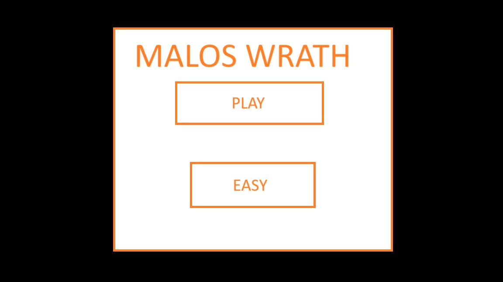
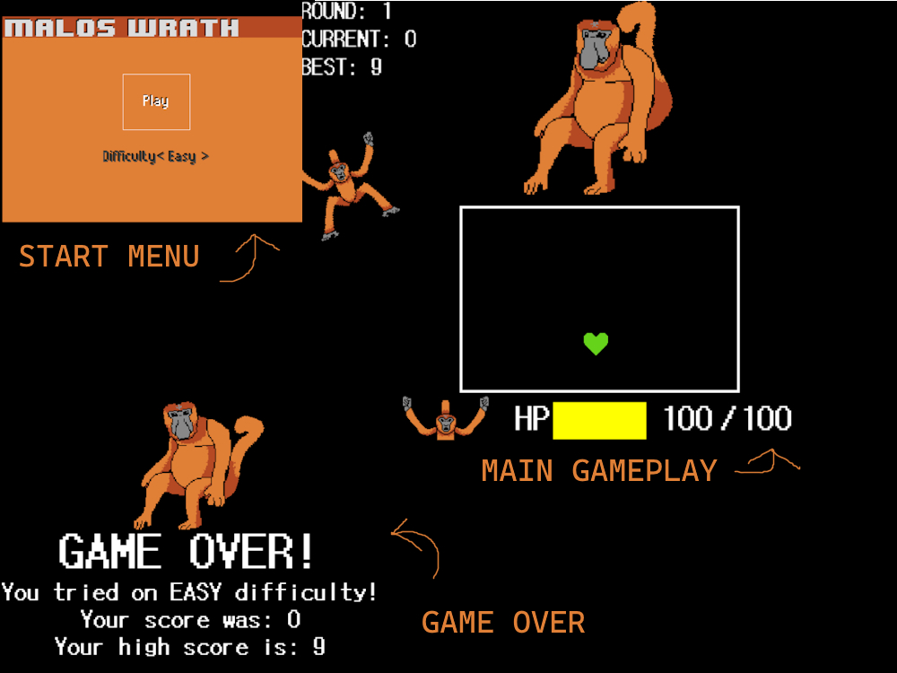

# MALOS WRATH
## CS110 Final Project Fall Semester, 2024

## Team Members

Hayden Harrell

***

## Project Description

A UNDERTALE-themed game where you have to survive Malo's attacks and try to reach a high score! Malo is a proboscis monkey who isn't too fond of humans, show your worth and see how long you can fend against him and his silliness!

***    

## GUI Design

### Initial Design

### Final Design

## Program Design

### Features
1. Moveable Player
2. Different Attacks
3. Health System
4. Initial Dialogue
5. Animations
6. Game Over Screen
7. Start Menu

### Classes

- GUI - Handles anything that has to do with on screen interfaces besides the start menu, such as displaying health, text, or high score data.
- MALO - Handles the animation of Malo as well as his unique attacks. Heavily communicates with the PROJECTILES class and has additional behavior for the projectiles unqiue to his attacks.
- MESSAGE - Handles the introductory dialogue that the player sees, and has all the dialogue stored in the class.
- PLAYER - Handles anything to do with the player and highscore, such as speed as well as collision and health.
- PROJECTILES - Holds a lot of information for the projectiles and has a lot of unique manipulatable properties that allow for the projectiles to hold different functions for different variants of the projectile.
- RECTANGLE - Simply the rectangle that encapsulates the player as well as the introductory message box.

## ATP
### Test Case 1: Start Menu Functionality
#### Description: Verify that the user can interact with both menu buttons.
#### Steps:
1. Start the game.
2. Move arrow keys down or select the difficulty button (second button).
3. Press arrow key left or right or press the button.
4. Verify that the difficulty labeled on the button changes.
5. Move arrow keys up or select the play button (first button).
6. The game should start, hiding the start menu, and showing Malo and introductory dialogue.
#### Expected Outcome: The Start Menu's buttons should work as intended and make sure that the difficulty is changeable as well as the game is able to start.

### Test Case 2: Malo Animation
#### Description: Verify that Malo animates properly.
#### Steps:
1. Start the game.
2. Press 'Play' on the start menu.
3. Malo should appear, verify that his tail moves.
4. Alongside his tail his body should also have a bounce animation.
5. Verify that Malo's head occassionally stares at the player, and ocassionally "honks" at the player.
6. When not staring at player, verify that Malo's head does move from left to right and back.
#### Expected Outcome: Malo should appear vivid and alive and animate.

### Test Case 3: Player Movement
#### Description: Verify that the player once given control can move.
#### Steps:
1. Start the game.
2. Press 'Play' on the start menu.
3. Skip through all the introductory dialogue by repeatedly pressing 'Enter'
4. Once the rectangle shrinks, the player's green heart icon should appear.
5. Verify that the player can move by pressing WASD or any of the arrow keys.
6. Verify that the player also has collision with the rectangle, and cannot go beyond it.
#### Expected Outcome: The player should be able to move its' green heart icon as well as be encapsulated by the rectangle.
### Test Case 4: Game Over
#### Description: Verify that the player can die at 0 HP and the game over menu appears.
#### Steps:
1. Start the game.
2. Press 'Play' on the start menu.
3. Skip through all the introductory dialogue by repeatedly pressing 'Enter'
4. Once Malo starts either of his attacks, purposely take damage by running into the projectiles.
5. Once the player's health goes to 0, (indicated by the health bar), verify that the game immediately goes to a game over screen.
6. Verify that the game over screen displays the difficulty played on as well as the current and saved high score for the difficulty.
#### Expected Outcome: The game over screen should display once the player loses all health and display any information about the current difficulty mode played in.
### Test Case 5: High Score Saving
#### Description: Verify that high scores are saved.
#### Steps:
1. Start the game.
2. Press 'Play' on the start menu.
3. Skip through all the introductory dialogue by repeatedly pressing 'Enter'
4. Once Malo starts either of his attacks, try progressing through multiple rounds of his attacks. Progress far enough to have a high score greater than your previous so that your new high score becomes your current score.
5. Take enough damage from projectiles to result in a game over.
6. Once in a game over, verify that the game over displays your current high score.
7. Check highscore.json in the 'src' folder, verify that your high score saved corresponding to your game difficulty.
#### Expected Outcome: The game over screen should display once the player loses all health and display any information about the current difficulty mode played in.